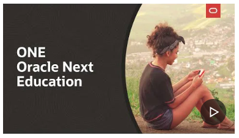

## Hi, I'm Marcelo Bevilacqua De Andrade 💻

<h1 align="center"> Projeto Challenge Portifólio  - Oracle ONE + Alura </h1>

 📜  Projeto Meu Portifólio </a> 📜 

 👋 Sejam bem-vindos ao meu projeto , você vai conhecer mais sobre o:
 
 <strong>APRENDENDO NA PRÁTICA ATRAVÉS DO CURSO INICIANTE EM PROGRAMAÇÃO T7-ONE,DISPONIBILIZADO PELA PLATAFORMA ALURA EM PARCERIA COM A ORACLE .</strong>

 Desafio este que tive a honra de co-criar com a plataforma de cursos online <strong>

</strong> 💛 https://cursos.alura.com.br e https://www.oracle.com/br/education/oracle-next-education/ 🧡 e disponibilizado de forma gratuita para a comunidade. 

   
 💎 O objetivo principal é colocar em prática algumas das principais ferramentas para a construção de paginas web: <strong> HTML, CSS, JAVASCRIPT</strong> através de aulas dinamicas e intuitivas com exemplos práticos e exercicios.

<h3 align="center">🛑 Não sendo exigidos nenhum Pré-Requisitos para aprender essas tecnologias.</h3>

Através da inscrição para a seleção de candidatos no site   , fui selecionado e presenteado com uma bolsa para este curso oferecido entre uma parceria da Oracle Next Educadion e Alura, O ONE é um programa de educação e empregabilidade com objetivo social de capacitar pessoas em tecnologia e conectá-las com o mercado de trabalho por meio de empresas parceiras.

    

Ao longo de 30 dias e reservando pelo menos 4 horas por dia foi possível concluir a primeira etapa que foi dividida entre os cursos de 📚  HTML  📚 CSS 📚 JS ,  e assim aprender  <strong> Lógica de programação</strong>.Após essa etapa cheguei na <strong>terceira fase </strong> chamada <strong>Praticando Front End : Desafio Portifólio </strong>, em que o desafio é criar um portifólio conforme orientações passadas nas aulas. 

E para esta jornada tivemos uma equipe de peso ministrando as aulas, que foram eles :  

    

Com essa terceira etapa concluida foi possível compreender 👣 passo a passo 👣 como são utilizadas algumas  🛠️ ferramentas 🛠️ de criação no CSS e HTML.

   

<h1 align="center"> ⚡ 🛑 O Desafio</h1>

   

<h2 align="center">Praticando Front End :Challenge Portifólio</h2>

Ao final do curso de Front End foi disposto um desafio chamado de Challenge, e criar um Portifólio.O objetivo é mostrar minhas experiências em programação , meus hobbies e soft skills, serviços que realizo , enfim contar um pouco sobre trajetoria de vida e trabalho.

<h3 align="center">🔺Tecnologias usadas 🎯</h3>

🔹 <strong>Html</strong> 
🔹 <strong>CSS</strong> 
🔹 <strong>Javascript</strong> 
🔹 <strong>Git</strong> 
🔹 <strong>Github</strong> 

<h3 align="center">🔺Link do Portifólio</h3> 

<h1 align="center"> 

✅  https://portifolio-challenge-alura-2024.vercel.app/  

</h1>

    

<h2 align="center">💡 ‼️ ESTE REPOSITÓRIO FOI CRIADO PARA O PROJETO CHALLENGE E PARA FINS DE ESTUDO. ‼️
 </h2>
 <h2 align="center"> <strong> Marcelo Bevilacqua de Andrade  </strong></h2>

    

 <h4>🛑🎨 Fontes/Imagens</h4>
 ✅  https://cursos.alura.com.br  
 ✅  https://www.oracle.com/br/education/oracle-next-education/ 
 ✅  https://vercel.com  

 

